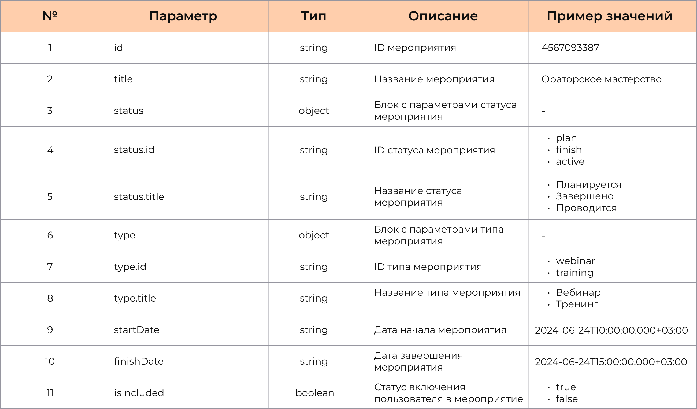

Основная информация 
Задача: разработка календаря обучающих мероприятий для корпроративного университет компании S;
Бизнес-постановка: Пользователь имеет возможность просматривать календарь обучающих мероприятий, возможность просматривать подробную информацию о выбранном мероприятии. Для удобство использования предусмотреть фильтр по типу события, статусу и наличию пользователя в событии.
Стек технологий: HTML, CSS, JS, UI-библиотека - Bootstrap

История изменений документа:
Версия 1.0.0
Дата: 18.06.2024
Изменения: -;

Примеры запросы данных: 
Примеры запросы метода getEvents

Примеры запросы метода getEventInfo

Входные параметры:
Входные параметры метода getEvents

Входные параметры метода getEventInfo

Описание интеграции:
