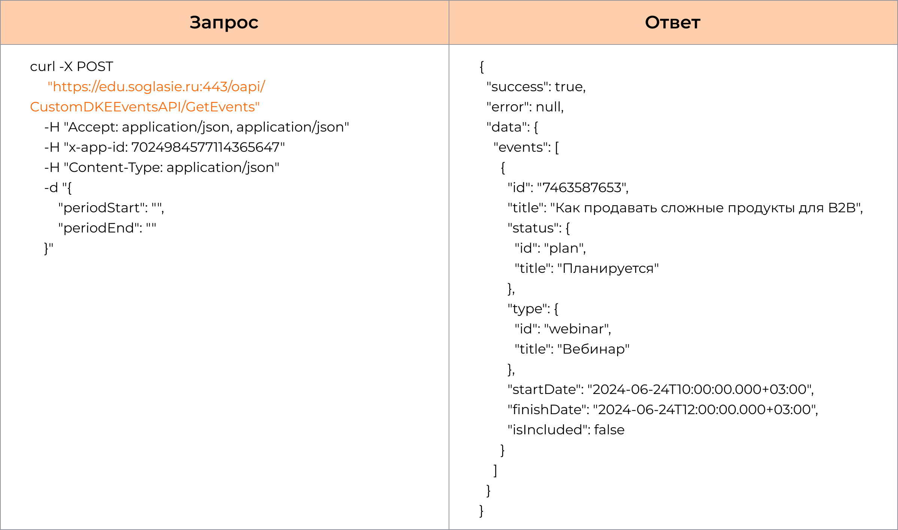
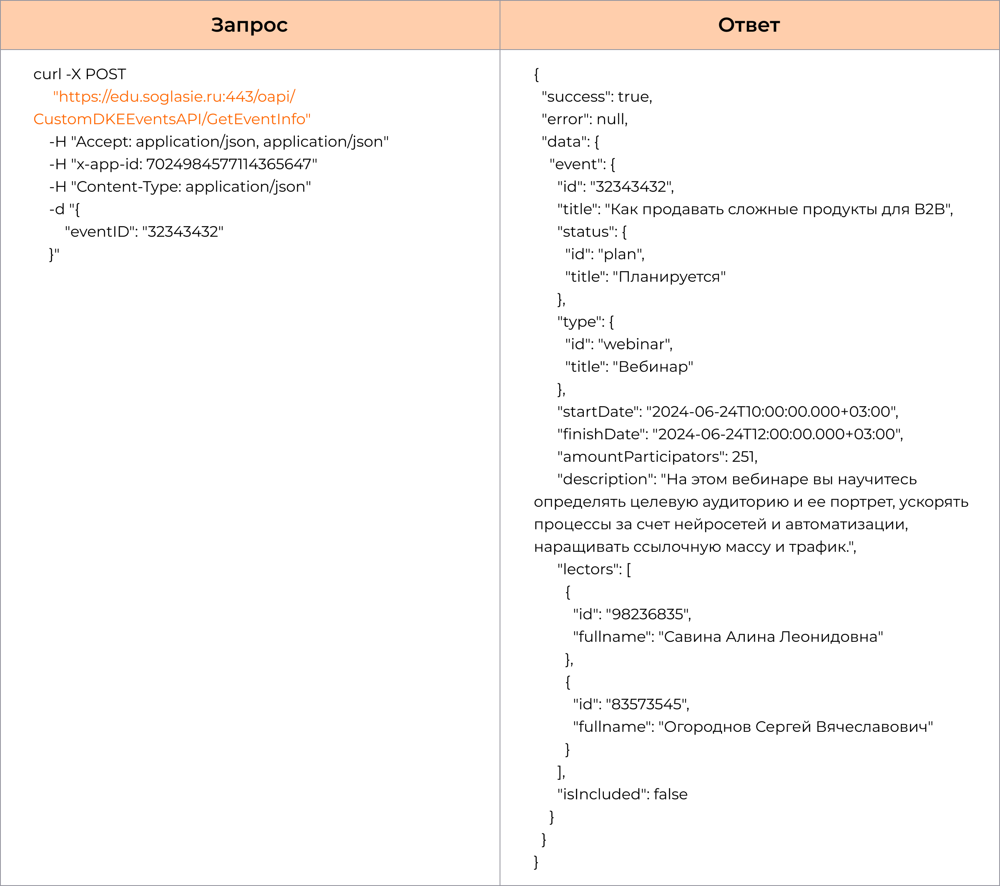
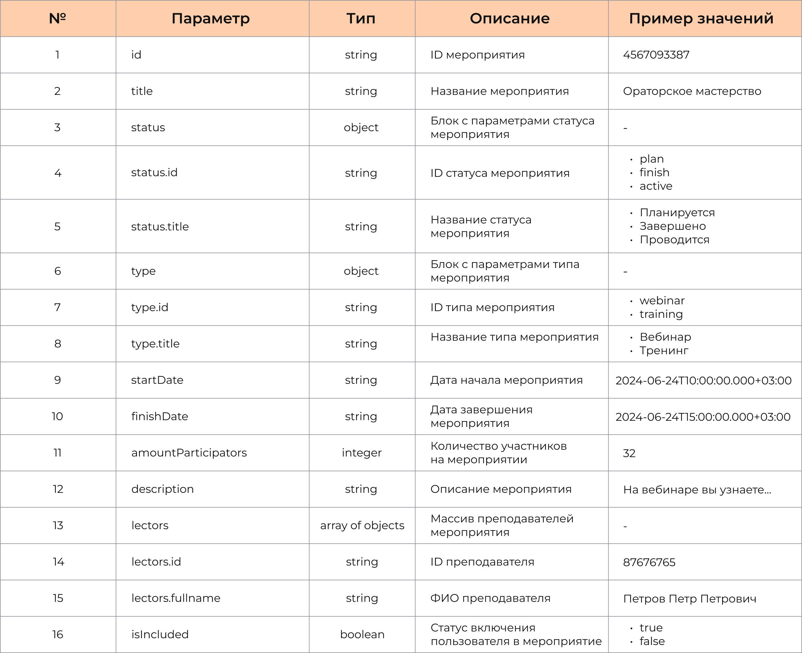
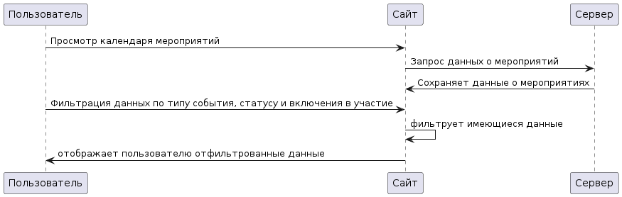

Основная информация 
Авторы: 
Задача: разработка календаря обучающих мероприятий для корпроративного университет компании S;
Бизнес-постановка: Пользователь имеет возможность просматривать календарь обучающих мероприятий, возможность просматривать подробную информацию о выбранном мероприятии. Для удобство использования предусмотреть фильтр по типу события, статусу и наличию пользователя в событии.

История изменений документа:
Версия 1.0.0
Дата: 18.06.2024
Авторы:
Изменения: -;

Примеры запросы данных: 

Входные параметры:
Входные параметры метода getEvents

Входные параметры метода getEventInfo

Описание интеграции:
